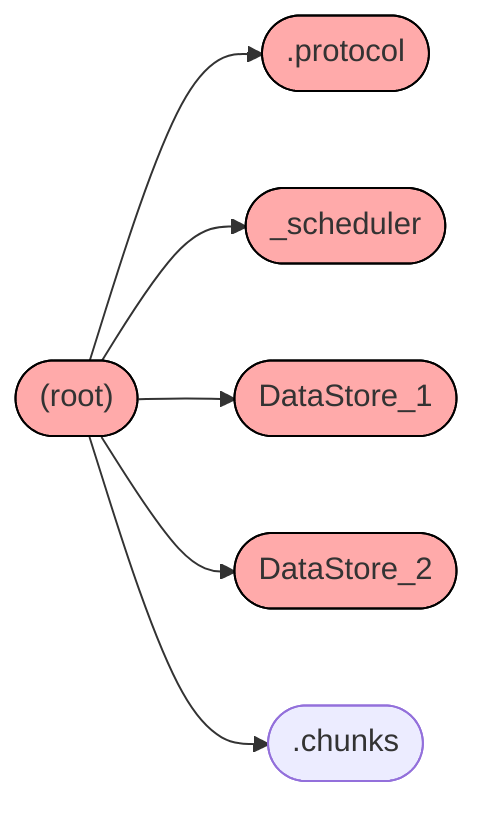
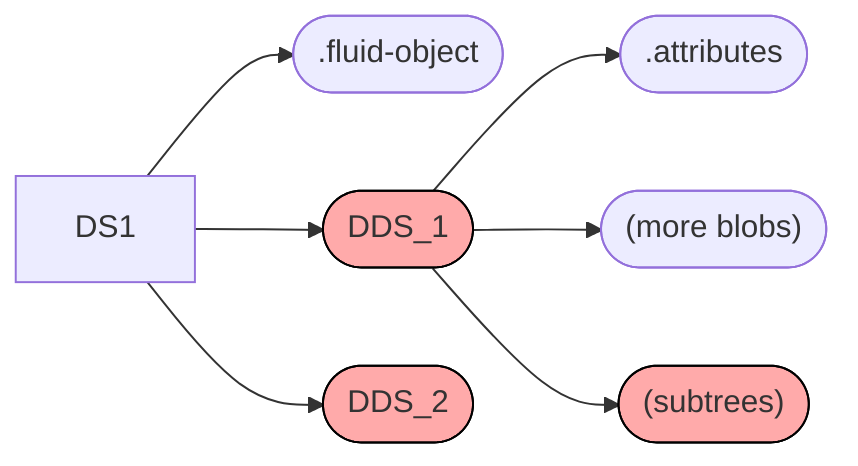
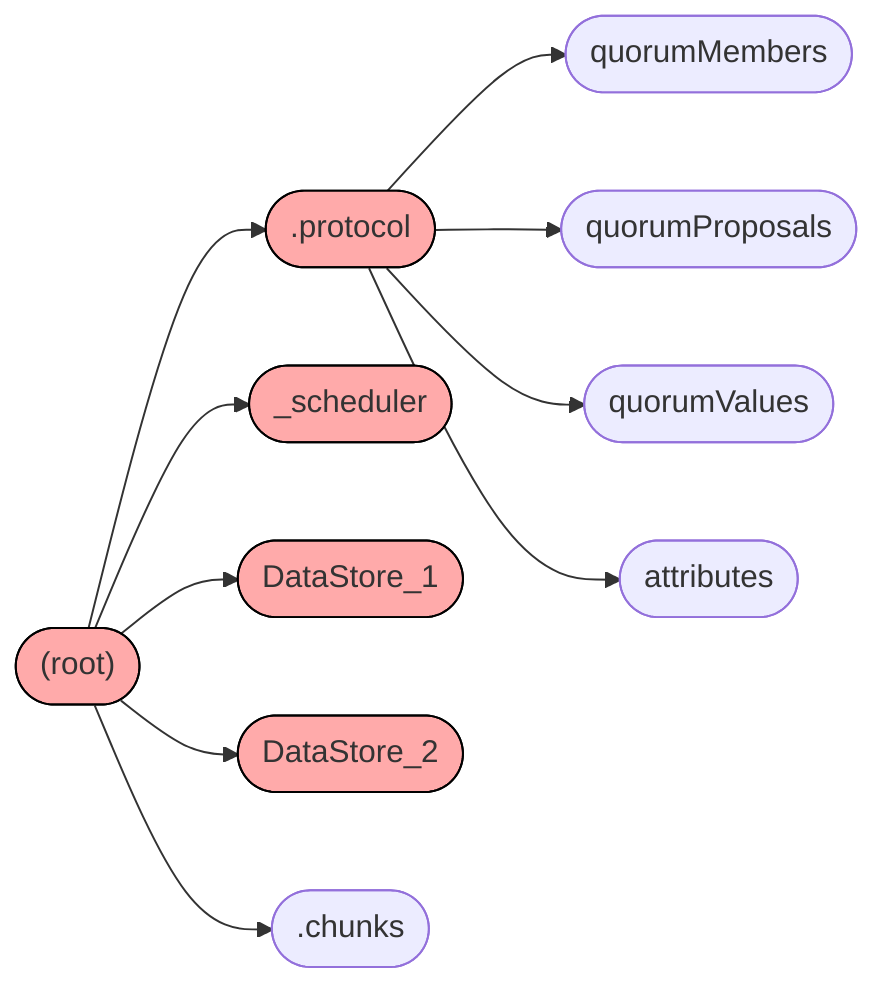

# 摘要
摘要是**客户端生成**的给定序号的文档状态快照.它巩固了运营
通过序列化数据模型进行记录.

## 摘要的形状

摘要采用的形式是由树组成的集合.树中的每一层(每个第一层)都与运行时模型平行.根节点对应于Container,它包含协议信息以及任何 部分处理(还未完成的) 数据块
部分信息.
处理的块操作数据.

### 协议

摘要的协议子树由服务器生成.服务器负责增加(augmenting)
被提出的(the proposed)摘要,将其粘贴到树的根部,同时予以确认.协议包含有关仲裁的信息:包括客户端加入/离开消息和仲裁提议的数据.它还包含文件属性:该时间点的文档ID,序列号和最小序列号.

### fluid数据存储

第二层由为fluid数据存储(v服务)的子树组成,fluid数据存储 已附加并绑定到容器.它们必须具有唯一的ID,该ID通常由运行时决定,以防止发生冲突.这将对
所有绑定数据存储的列表
是扁平的.句柄引用的嵌套数据存储与该图的结构无关.

每个Fluid Data Store子树将只有一个元数据Blob,Blob其中包含有关如何加载其(Fluid Data Store)代码的信息.

### 分布式数据结构

第三层由一个子树组成,用于(for)在每个Fluid Data Store中找到的每个分布式数据结构.他们也具有由运行时生成的唯一ID.父节点是DDS绑定到的fluid数据存储,因此图与DDS如何通过其句柄引用另一个对象无关.

(They will have a single metadata blob containing information for how to load the code given the registry collections found in higher layers)
他们将有一个单一的(single)元数据blob,其中包含有关如何
在较高的层中, 给定注册表集合的情况下, 找到的
加载代码的信息.每个子树可以根据需要具有其他Blob或子树.

### 摘要句柄

有时,自上次摘要成功以来,摘要中的节点/子树一直保持不变,或者希望由
下一个摘要复用.在这种情况下,上传摘要时,可以使用句柄代替树木或blob.句柄是
指向前一棵树内节点的指针.句柄本身只是指向它所引用的节点的完整路径,对于
示例:"/dataStoreId/ddsId"将引用数据存储中ID为"dataStoreId"的数据结构ID为"ddsId"的子树
.当上传到 存储 时,使用此路径的驱动程序 将结合 先前上传载的摘要ID来解析这些句柄.

## 摘要生命周期

1. 运行时生成摘要树(下面有更多详细信息).
1. 运行时将摘要树上传到存储器,该树将返回一个句柄.
1. 运行时向包含该上传的摘要句柄的服务器提交"摘要化"操作.
1. 在服务器上(订购服务并盖章)排序服务时间戳并广播"摘要"操作.
1. 服务器上的另一个服务响应"摘要"操作.
    - 服务器可以通过发送引用"summaryize"操作的序列号的"summaryNack"操作来拒绝该摘要.
    - 服务器可以接受摘要,但是首先它必须序列化协议状态并将其添加到要发布的概要.然后,它将需要将带有新句柄的"summaryAck"op发送到扩充摘要上.
1. 运行时监视"summaryAck"/"summaryNack"操作,使用它们作为输入来启发的确定何时生成摘要

## 摘要

汇总(摘要)工作由 运行时中的多个部分组成.目前,所有汇总(摘要)工作都在
单独的代理客户端,这有助于防止其进行任何本地操作.

### 摘要管理器

**"摘要管理器"**在每个连接的客户端上运行,其主要作用是确定应将哪个客户端负责汇总(摘要)(摘要化),然后生成和管理单独的"摘要化"客户端.(leader)

客户仅被"选出"(成为管理员)仅因为其是仲裁组中的最老成员,管理员负责汇总(摘要)(摘要化).
管理器是一种状态机,它会在每次连接/断开连接或成员加入/离开仲裁组 时 检查状态的更改.
因为客户端加入/离开消息是在仲裁组中是有序,
所以,在给定序列号时(处),所有客户端都将具有相同的信息.也是就说 检查 客户端列表中的第一个,就足够了.
为了防止意外生成多个"摘要化"或一个也没有生成,保持这一简单性和确定性是重要的.

一旦客户端决定负责生成摘要化的客户端,它将通过加载器发出并带有特殊参数的请求,来强制使用新容器,并指示该容器不是交互式的.它(新容器)
会运行在生成(摘要化的)客户端上,并监听它.以便(执行)断开连接/结束运行.

### 摘要化

客户端生成摘要化客户端后,摘要化客户端将使用Summarizer(摘要化)对象,来对实际生成的摘要 进行 启发式搜索.底层的数据结构将监视
操作(事件)以便
跟踪到目前为止的摘要轨迹.包括自上次摘要以来,经过了多少次操作/经过了多少时间.

启发式的配置(参数)由服务器提供.它们包括以下几种:

- `maxOps`-自上次成功汇总(摘要)以来的最大操作数,然后尝试再次汇总(摘要)
- `maxTime`-自上次成功汇总(摘要)以来在尝试再次汇总(摘要)之前的最长时间
- `idleTime`-总结之前空闲时等待的时间
- `maxAckWaitTimeout`-等待服务器响应确认或不确认的最长时间

通常,摘要程序在尝试进行摘要操作之前会等待操作中断.~~这是~~在`idleTime`配置时,如果客户端已经处于"idleTime"(当前为15秒)且没有收到任何操作(事件),则它将尝试进行摘要操作.如果
一个操作进来,它将重置空闲计时器.

即使在"idleTime"触发之前始终有操作进入,如果接收到"maxOps"(当前有500个操作)操作或自上次成功汇总(摘要)以来已过了"maxTime"(当前为1分钟),客户端仍将尝试进行汇总(摘要).

Summarizer会根据运行时的其余部分实际生成摘要,将其上传到存储中,然后提交这个事件(摘要化).一旦完成(提交),它将监视 那些 要广播的摘要事件,
然后继续等待 从服务器作为响应 进来 的 摘要事件确认事件或否定事件. 在等待期,它将不会尝试生成另一个摘要.
在大多数情况下,服务器应以确认/否定 快速响应.在某些情况下,它可能永远也不会出现或(花费)很长的时间,在这种情况下,当等待的时间会超过"maxAckWaitTimeout",客户端尝试生成并发送另一个请求时,
概要.

#### 以"安全"模式重试

如果在汇总(摘要)时遇到意外错误或服务器发送了错误消息,则运行时将重试一次
"安全"模式.这会做两件事:

1. 首先询问服务器最新的成功摘要ID是什么.
它这样做是为了通过自己的状态~~跟踪~~信息来应对问题.这解决了服务器实际同意了摘要但无法发送ack op的问题.
2. 然后生成将fullTree设置为true的摘要.这将阻止任何子树复用优化.它会
   尝试生成整个树,无论自上次摘要以来是否已更改.

### 容器运行时

容器运行时实际上负责生成摘要,将摘要上传到存储并提交摘要.

#### 生成摘要

容器运行时将 **部分接收到的分块操作 存储在单独的Blob中**.然后它将遍历所有它已绑定到的fluid数据存储(Fluid Data Stores),并调用它们各自的摘要函数.

每个fluid数据存储上下文将其元数据存储在Blob中.然后它将加载/实现自身.它加载其Fluid数据存储运行时,并调用其内部汇总(摘要)功能.然后,fluid数据存储运行时将循环遍历每个它具有DDS并调用其摘要功能.

同样,每个DDS会将其元数据存储在Blob中.它将确保已加载并调用其自定义序列化功能.

### 摘要化器节点

在摘要生成的这些层中,通用功能由Summarizer Node对象封装.
摘要化节点形成一棵与容器,fluid数据存储上下文和通道上下文树(分布式数据结构)平行的树.
需要它们来跟踪 每个节点相关的 已完成和未决摘要的所有状态.
状态是必需的,以帮助每个节点从先前的摘要中确定是否可以重用(回滚)它,并且
是否可以在错误情况下生成后备"失败"摘要.

它们通过跟踪最新成功的摘要参考序列号以及父路径和该节点的
路径部分.这些路径很重要,因为生成"故障"摘要时它们实际上可以更改."失败摘要"是指当 摘要化发生时 fluid数据存储汇总(摘要)时遇到错误,如果可能,它将(替代的)发送一个句柄.以指向此子树的最后一个成功摘要,以及自此以来指向该数据存储的大量未完成操作.
这样做是为了将问题隔离到单个数据存储中.发生这种情况时,摘要将包含
所有连续的故障(信息)的嵌套子树. 连续的故障(信息) ~~这~~会使树中子节点的基本路径复杂化.

他们还通过比较(decide)  
有 成功的摘要序列号 的 子树,来 
决定何时可以
复用最后一个更改树序号.
然后,他们使用路径跟踪来确定要发送的路径.