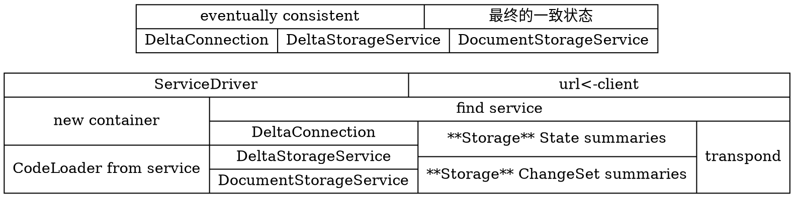

# Architecture
Fluid Framework可以分为三个主要部分:_Fluid loader_,_Fluid container_ 和 _Fluid service_.
尽管这些内容在其他地方都有更详细的介绍,但我们将使用此空间从较高的角度解释这些领域,
确定重要的低层概念,并讨论我们的一些关键设计决策.

## 介绍

fluid加载器连接到fluid服务并加载fluid容器.


如果要在应用程序或网站上加载Fluid容器,请使用Fluid加载器加载该容器.如果你想要使用Fluid Framework创建新的协作体验,您将创建一个Fluid容器.

fluid容器包含状态和应用逻辑.这是具有数据持久性的无服务器应用程序模型.它至少有一个
_Fluid object_,封装了应用程序逻辑.fluid对象可以具有状态,该状态由_分布式数据结构
_(DDSes)管理.

DDS用于将状态分发给客户端.而不是将合并逻辑集中在
服务器,服务器将更改(也称为操作或操作)传递给客户端,然后客户端执行合并.

## 设计决策

### 保持服务器简单

在现有的生产级协作算法中,例如操作转换(OT),显着的延迟是
在合并逻辑的服务器端处理期间引入.

通过将合并逻辑移至客户端,我们大大减少了延迟.我们向客户推送的逻辑越多,则在数据中心对请求花费的毫秒数越少.

### 将逻辑移至客户端

由于合并逻辑是在客户端上执行的,因此连接到分布式数据的其他应用逻辑也应该是在客户端执行.

所有客户端必须加载相同的合并逻辑和应用逻辑,以便客户端可以计算最终一致的状态.

### 模拟(并拥抱)网络

Fluid Framework通过将状态和逻辑分配给客户端来创建分布式应用程序模型.因为网络是
已经是一个用于访问应用程序逻辑和应用程序状态的系统,我们在模型中尽可能模拟了现有的Web协议.

## 系统总览

大多数开发人员将使用Fluid框架加载Fluid内容或创建Fluid内容.用我们自己的话说,开发人员
正在使用fluid加载器加载fluid容器,或者开发人员正在创建要加载的fluid容器.

基于我们的"保持服务器简单"和"将逻辑移动到客户端"这两个设计原则,大多数fluid
代码库专注于构建容器.

### Fluid容器

Fluid容器在包含持久性数据的同时定义了应用程序逻辑.如果Fluid Framework是无服务器的
在具有持久数据的应用程序模型中,容器是无服务器的应用程序和数据.

fluid容器是"将逻辑移动到客户端","容器包含合并逻辑
用于在连接的客户端之间复制状态"原则的结果,但该容器还包含应用程序逻辑.合并逻辑是
封装在我们最低级别的对象中的分布式数据结构(DDS).操作此数据的应用逻辑是存储在"fluid对象"中.

### fluid装载机

fluid loader通过连接到fluid服务来加载fluid容器(及其子fluid对象)并~~提取~~加载fluid容器代码.这样,fluid加载器"模仿了网络". Fluid loader的解析器 使用**容器的解析器**进行URL解析,然后使用**Fluid  service driver(服务驱动程序)**连接到Fluid服务,并使用
**代码加载器**来加载正确的app代码


```
译者注:
URL + Floader.resolve=>container.resolver ==> url
  url被Fluid service driver消费 ==> 连接Fluid service,生成容器和三个对象,用三个对象与服务器通信并维复状态
```

**容器查找(器)和解析器**通过URL识别 容器要绑定到 的 服务,
以及识别该服务位于何处. Fluid服务驱动程序使用此信息.

**Fluid服务驱动程序**连接到Fluid服务.Fluid服务驱动程序
在服务器上请求用于新Fluid容器的空间,并
创建三个对象,即**DeltaConnection**,**DeltaStorageService**和**DocumentStorageService**.Fluid容器使用这三个对象来与服务器通信并维持最终的一致状态.

**容器代码加载器**获取容器代码.因为所有客户端运行相同的代码,所以客户端使用代码加载器获取容器代码.装载程序执行此代码以创建fluid容器.


### fluid服务

fluid服务主要是全序广播:它接收每个客户的更改(称为"操作"或"操作")
,给操作一个有序的序列号,然后将有序的操作发送回每个客户.分布式数据
结构使用这些操作来重建每个客户端上的状态.**Fluid服务不会解析任何一个这些操作**.事实上,该服务对任何Fluid容器的内容一无所知.


从客户端的角度来看,操作流是通过DeltaConnection对象访问的.
当然,服务会存储以前的操作流(可通过**DeltaStorageService**对象供客户端访问),并存储fluid对象的摘要(summaries 阶段结果). 值得详细说明的是,目彰考虑合并1,000,000个更改可能需要一些时间,因此我们汇总(摘要)了对象的状态并将其存储在服务中以加快速度加载中.

